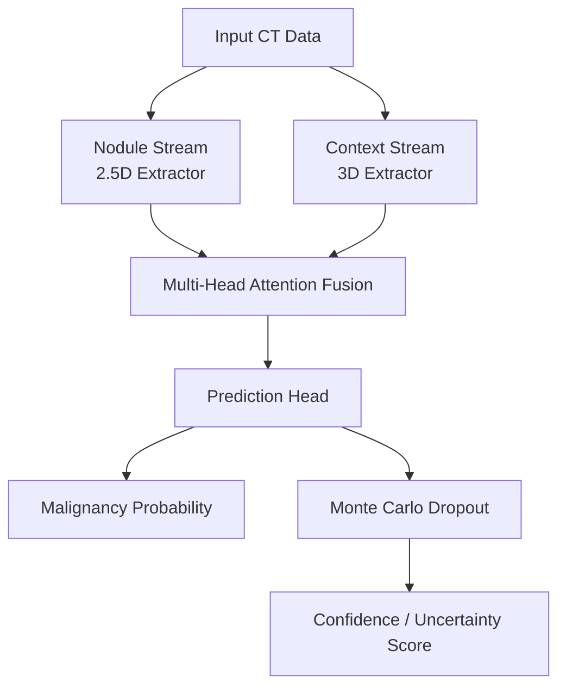
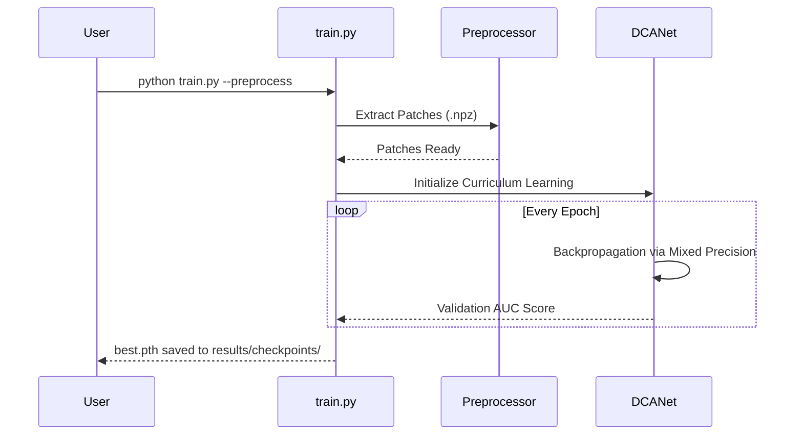

# OncoVision-X

OncoVision-X is a memory-efficient CAD (Computer-Aided Diagnosis) system designed for automated lung nodule malignancy classification. Built upon the LUNA16 benchmark dataset, it utilizes the **Dual-Context Attention Network (DCA-Net)** to perform classification with high precision and clinical uncertainty quantification. 

By integrating dual-stream architectural processing, it learns critical 3D spatial properties while dramatically curtailing hardware constraints associated with pure volumetric convolutions.

## Architectural Philosophy

Standard algorithms treat lung nodules sequentially or in spatial isolation. OncoVision-X mirrors clinical logic by assessing nodules conjointly with their surrounding pulmonary environment.



1. **Stream 1 (Nodule Extractor)** identifies spiculation, calcification, and edge properties dynamically through a 2.5D cross-slice processing interface mapping 64x64 slices.
2. **Stream 2 (Anatomical Extractor)** generates an absolute 3D feature representation mapping airways, blood vessels, and pleural boundaries natively through lightweight operators on 48x48x48 regions.
3. **Multi-Head Attention Fusion** bridges analytical dissonance, predicting malignancy. 
4. **Monte Carlo Dropout** calculates model confidence bounds natively to simulate safe decision thresholds equivalent to clinical standards.

### Core Documentation

Extensive component structures and data flow models have been mapped. Proceed to the `docs/` module to learn the underlying engine dynamics:

* [Architecture Overview](docs/architecture.md) (DCA-Net structure, Attention modules, and Uncertainty Quantification strategies)
* [Data Processing Pipeline](docs/data_pipeline.md) (Patch Extractor logic and intelligent sampling)
* [Training and Evaluation Specifications](docs/evaluation_and_training.md) (Curriculum learning flows and clinical export optimizations)

## Installation and Requirements

The framework requires PyTorch mapped to Python 3.10 or higher. Install requirements using standard Python environment packaging:

```bash
pip install -r requirements.txt
```

### Dataset Structure Requirement

Processing operates explicitly via `.mhd` and `.raw` formats supplied by the LUNA16 guidelines. Expected directory structuring follows:

```text
data/
  annotations.csv
  candidates.csv
  seg-lungs-LUNA16/
  subset0/
  ...
```

## Running the Pipeline

OncoVision-X contains a powerful set of CLI tools for pre-processing, training, and evaluation.

### 1. Training (`train.py`)

The training script manages datasets, runs the preprocessing routines, and executes the progressive curriculum learning. 

```bash
# Standard training run using default config
python train.py

# Run preprocessing first, then train
python train.py --preprocess

# ONLY execute preprocessing (patch extraction) without training
python train.py --preprocess-only

# Resume training from the last saved checkpoint
python train.py --resume

# Specify a custom YAML configuration file
python train.py --config configs/custom_config.yaml

# Run a quick 2-batch dry run to verify the pipeline
python train.py --dry-run
```

**Training Workflow:**



### 2. Evaluation (`evaluate.py`)

Run comprehensive analysis post-training to generate all performance metrics, Explainable AI plots, and Grad-CAM++ reports.

```bash
# Evaluate the best automatic model checkpoint on the test set
python evaluate.py

# Evaluate a specific model checkpoint
python evaluate.py --checkpoint results/checkpoints/some_checkpoint.pth

# Run evaluation faster by disabling Monte Carlo Dropout Uncertainty Tracking
python evaluate.py --no-uncertainty

# Direct evaluation output plots and metrics to a custom directory
python evaluate.py --output results/my_custom_eval
```

Outputs will aggregate in the designated `--output` pathing (defaults to `results/evaluation`), populating structural JSON statistics, visual plots, and narrative reports mapped by the architecture's Explainable AI features.

## Clinical Disclaimer

OncoVision-X intends strictly for research. Outputs do not supplement or override validated radiological screening, diagnostic intervention, or formal physician guidance.
