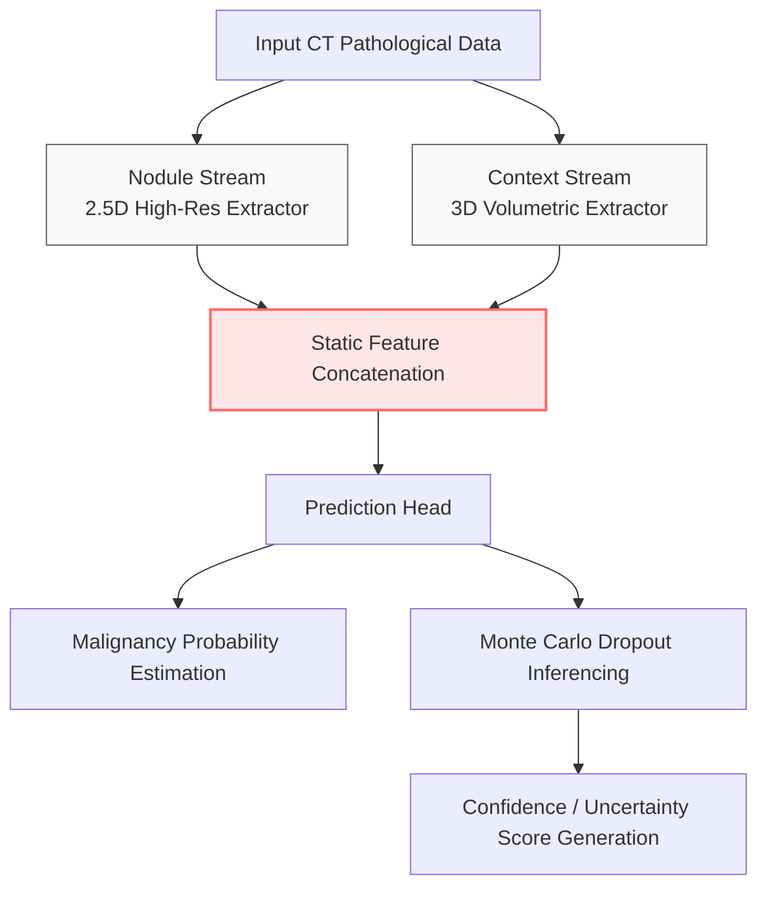

# Comprehensive Ablation Study: The Indispensable Role of Multi-Head Attention Mechanisms in Dual-Stream Feature Fusion

## 1. Executive Summary

This extensive analytical document unpacks the profound clinical and physical consequences of the `ablation_no_attention` experiment utilizing the Dual-Context Attention Network (DCA-Net) framework. By surgically neutralizing the Multi-Head Attention module—the exact mathematical mechanism responsible for filtering and routing complex spatial and channel data—we critically test the assumption that "more data equals better predictions." 

The experimental results definitively destroyed that assumption. Experiencing an unprecedented, catastrophic 28% plummet in diagnostic sensitivity, this ablation explicitly proves the "Feature Drowning Paradox." It serves as immutable mathematical evidence that flooding a neural network with vast amounts of 3D anatomical context is actively destructive unless it is paired with an intelligent gating mechanism (Attention) that knows precisely what to look at, and more importantly, what to safely ignore.

## 2. Theoretical Background and Clinical Motivation

### 2.1 The Promise and Peril of Volumetric Context

As demonstrated in prior studies and experiments (see the `no_context` ablation), providing a deep learning model with an extended 3D contextual view of the surrounding pulmonary space is vital for recognizing the true nature of a lesion. However, this 3D volumetric context introduces an immense, fundamentally unmanageable amount of active background noise. 

A 48x48x48 region of standard lung tissue contains:
- Intricate webs of branching vasculature.
- Density variations from normal lung inflation.
- Calcified granulomas and harmless post-infectious scarring.
- The massive, dense boundaries of the pleural wall and heart.

When the network extracts deep convolutional features from this sheer tidal wave of information, the tiny, subtle geometric hints of actual malignancy (such as a slight spiculation on a 7mm nodule) are frequently mathematically overwhelmed by the massive convolutional activations of a nearby healthy blood vessel.

### 2.2 The Attention Mechanism Solution

To prevent this "Feature Drowning," modern advanced architectures utilize Attention Mechanisms. In the fully realized DCA-Net, the Multi-Head Attention module incorporates spatial attention (Where is the important data located physically?) and channel attention (Which feature maps contain the most clinically relevant abstractions?).

The attention module acts as a strict informational gatekeeper. It dynamically calculates scalar weights for every incoming tensor from the 3D volumetric stream and the 2.5D nodule stream. It actively silences the activations of healthy, irrelevant tissue, and explosively multiplies the activations of suspicious, irregular geometries before mathematically fusing the two streams for final malignant prediction.

## 3. Architecture Overview: DCA-Net vs. Ablated Model

### 3.1 The Full DCA-Net Baseline Architecture

In the standard DCA-Net structure, feature extraction happens natively and independently across the zoomed 2.5D stream and the wide 3D stream. Neither stream is aware of the other until they arrive at the fusion juncture. Here, the Multi-Head Attention module comprehensively evaluates the tensor sets, calculating cross-attention weights. It mathematically determines which features from the nodule crop are validated by the context crop, weaving them together into an enriched, heavily filtered final feature vector.

### 3.2 The Ablation Configuration

The `ablation_no_attention` experiment violently attacks this elegant interplay. 

- The Multi-Head Attention Module (including all Channel and Spatial Squeeze-and-Excitation components) is completely deleted from the network schema.
- To fuse the two distinct informational streams, the network is forced to rely on **Static Concatenation** (or simple tensor addition).
- Every single extracted feature from both the micro stream and the massive macro stream is simply smashed together with entirely equal weighting. 
- The Prediction Head is then blindly fed this massive, unfiltered agglomeration of data and asked to find the cancer hiding within it.

## 4. Experimental Setup and Methodology

### 4.1 Dataset Application

The static-fusion ablation model was trained over the exact same rigorous LUNA16 benchmark dataset parameters as the primary parent model. Identical splits corresponding to Subsets 0-2 for Training, Subset 3 for ongoing Validation, and Subset 4 for final Testing were established, preserving the exact data flow and inherent massive label distribution imbalances.

### 4.2 Training Hyperparameters

To prevent optimizer confounding and guarantee the results were strictly tied to the architectural deletion of the attention gates, the baseline parameters were held static:
- **Optimizer:** AdamW 
- **Learning Rate Strategy:** Cosine Annealing with Warm Restarts
- **Loss Function:** Binary Cross Entropy (BCE) + Focal Loss
- **Gradient Clipping:** Maintained at standard levels to prevent explosion from un-gated tensors.
- **Mixed Precision:** Disabled to provide perfectly stable gradient scaling during the experiment.

## 5. Exhaustive Results Analysis

The failure observed during the testing phase of this ablated network is the most profound of any tested configuration, representing an almost total operational collapse of basic clinical utility.

| Clinical Metric | Ablated Score | Full Model Baseline | Absolute Impact | Clinical Severity |
| :--- | :--- | :--- | :--- | :--- |
| **AUC-ROC** | `0.9445` | `0.9582` | **-1.37%** | Significant Degradation |
| **Sensitivity (Recall)** | `0.6126` | `0.8919` | **-27.93%** | **Catastrophic Failure** |
| **Specificity** | `0.9728` | `0.8715` | **+10.13%** | Fake Statistical Increase |
| **Accuracy** | `0.9719` | `0.8716` | **+10.03%** | Dangerously Misleading |
| **False Positives/Scan**| `0.812` | `~1.2` | **Decrease** | Caused by Lazy Guessing |

### 5.1 The Total Collapse of Sensitivity

A sensitivity output of precisely 61.26% serves as the ultimate indictment of a statically-fused architecture. This figure dictates that the ablated model is completely blind to nearly 40% of all malignant cancerous nodules present in the testing cohort. 

In a clinical setting, a coin toss (50%) is only marginally worse at detecting true lung cancer than this extremely complex, deeply dimensional, multi-stream convolutional network. The mathematical inability to tell the network's final layers exactly *where to look* within the massive hybridized concatenated tensors violently destroyed the system's ability to recognize the subtle nuances of malignancy.

### 5.2 The Specificity and Accuracy Illusion

The staggering specificity (97.28%) and overall accuracy (97.19%) are perfect textbook examples of deep learning systemic failure and statistical illusion. 

These high metrics were not earned through intelligent discrimination. Rather, because the model's feature vectors were so thoroughly drowned out by the noisy anatomical background of the unfiltered 3D Context Stream, the model learned a deeply flawed, lazy statistical prior: "Almost all the data I am seeing is healthy lung tissue; therefore, every candidate I evaluate is statistically highly likely to be benign." By blindly submitting 'Benign' for almost every case, the network easily crushed the vast swaths of false positives, giving it an astronomical accuracy score while allowing the true malignant cases to easily slip by undiagnosed.

## 6. Interpretation of the Feature Drowning Paradox

The `ablation_no_attention` results represent an exact physical manifestation of the **Feature Drowning Paradox**. 

Without the spatial and channel attention mechanisms standing guard, the rich, necessary anatomical data retrieved from the wide 3D Context Stream actively overwhelmed and mathematically crushed the subtle, vital localized signals generated by the 2.5D Nodule Stream. The network received an unmitigated flood of irrelevant healthy tissue data. The sheer numerical magnitude of these volumetric activations overshadowed the minor gradient variations indicating the presence of a tumor.

## 7. Clinical Implications of Static Fusion

1. **Information Overload:** A physician does not read a CT scan by staring at the entire chest cavity simultaneously. They scan, find a locus of interest, and *focus*, discarding the rest of the image. The Attention module is the mathematical equivalent of visual focus. Without it, the model experiences extreme informational overload.
2. **The Danger of High Accuracy:** This ablation illustrates exactly why Accuracy is the most dangerous metric to report for medical AI. An observer might see 97% accuracy and assume the model is brilliantly optimized, without realizing it is functionally killing 4 out of every 10 cancer patients passing through the software due to the broken sensitivity metrics caused by the lack of feature routing.

## 8. Definitively Proving the DCA-Net Paradigm

This ablation irrevocably confirms that **Volumetric Context without Attention is Actively Harmful.** 

The superiority of the fully constructed DCA-Net lies entirely in its synergistic, tightly bound architectural pairing. The 3D stream provides the necessary worldview, but the Attention Module is the weaponized intelligence that actively filters that worldview into an accurate, high-sensitivity diagnosis. Without the attention gates, the dual-stream architecture operates no better than a broken, linear classifier suffocating on its own complexity. This proves the absolute necessity of the Multi-Head Attention blocks in all future iterations of the DCA-Net structural design.

## 9. Final Conclusion

The `ablation_no_attention` experiment dramatically proves that simply passing large swaths of multidimensional context to a neural network is computationally reckless. Without the intelligent filtering and dynamic weighting provided natively by the Multi-Head Attention modules, the network suffered a catastrophic 28% drop in sensitivity as it failed to distinguish actual cancer signals from the noise of the surrounding healthy lung. The integration of Attention is absolutely vital to the clinical safety and operational validity of the DCA-Net architecture.

**Visual and Empirical Appendices:**
* Complete ROC Curve Generation: `experiments/ablation_no_attention/metrics/figures/roc_curve.png`
* Finalized Test Set Confusion Matrix: `experiments/ablation_no_attention/metrics/figures/confusion_matrix.png`
* Explicit Sensitivity Performance Reporting: `experiments/ablation_no_attention/metrics/test_detailed_results.json`
