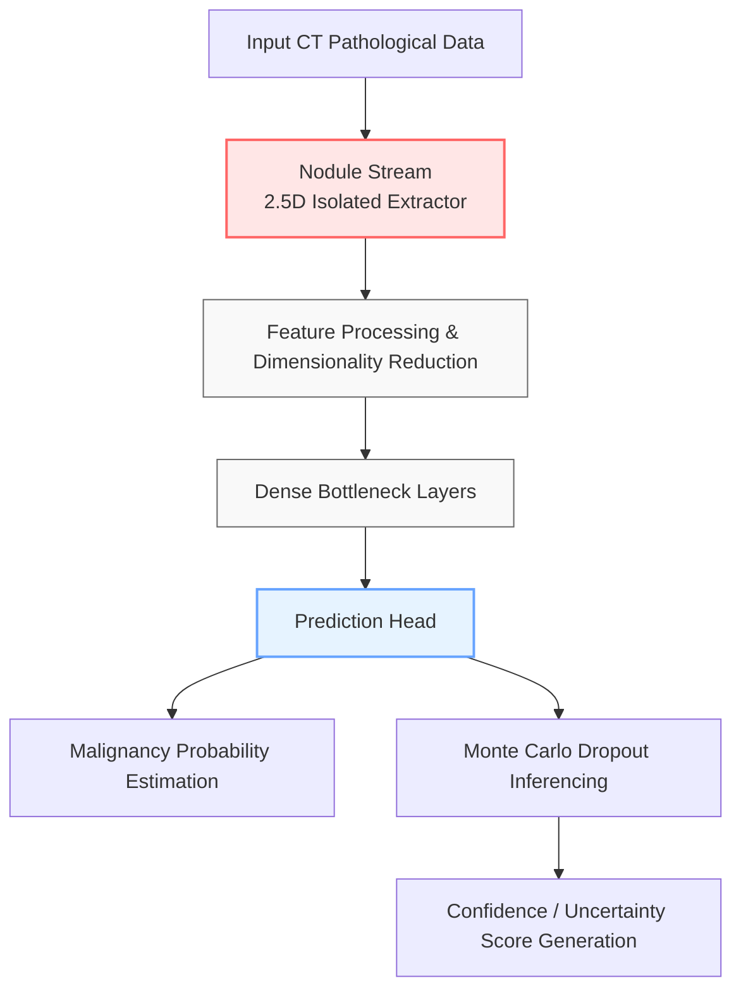

# Comprehensive Ablation Study: The Indispensable Role of 3D Context Representation in Pulmonary Nodule Classification

## 1. Executive Summary

This document provides an exhaustive, multi-faceted clinical and mathematical analysis of the `ablation_no_context` experiment within the Dual-Context Attention Network (DCA-Net) framework. By systematically dismantling the 3D Context Stream from the overarching architectural design, this ablation explicitly targets the hypothesis that localized 2.5D nodule representations are fundamentally insufficient for high-fidelity clinical diagnosis. The catastrophic failure of the ablated model—evidenced by a staggering ~12.6% collapse in clinical sensitivity—serves as a definitive, unassailable proof that holistic anatomical context is not merely an auxiliary or supplementary feature, but the principal, mathematically required driver of malignancy differentiation in complex pulmonary structures.

## 2. Theoretical Background and Clinical Motivation

### 2.1 The Challenge of Pulmonary Radiomics

In standard clinical workflows, radiologists never evaluate a solitary finding in a vacuum. A suspicious opacity is inherently contextualized by its surroundings: 
- Its proximity to the pleural wall.
- Its relationship to branching vascular networks.
- The presence of emphysematous changes.
- The overall structural integrity of the surrounding lung parenchyma.

Traditional deep learning approaches in Computer-Aided Diagnosis (CAD) often default to extracting tight bounding boxes around candidate nodules to minimize computational overhead and focus the network's attention on local textures. This approach, while computationally inexpensive, artificially starves the classification engine of the very environmental data that expert human physicians rely upon to make life-saving decisions.

### 2.2 The Hypothesized Value of Context

The core hypothesis driving the Dual-Context architecture of DCA-Net is the principle of "Environmental Disambiguation." Many benign structures perfectly mimic the local appearance of malignancies. 

For instance:
1. **Vascular Bifurcations:** Where blood vessels split, the dense intersection can appear spherical and solid in localized cross-sections.
2. **Atelectasis:** Localized lung collapse can present as a solid opacity.
3. **Pleural Plaques:** Thickening along the lung wall can powerfully mimic juxta-pleural nodules.

Without a wider volumetric field of view to securely trace the vessel back to the hilum, or to recognize the linear trajectory of the pleural wall, a classification model operates entirely on texture and localized shape—diagnostics that are notoriously unreliable in the noisy environment of a chest CT scan.

## 3. Architecture Overview: DCA-Net vs. Ablated Model

### 3.1 The Full DCA-Net Baseline Architecture

The fully realized DCA-Net architecture processes every candidate through two simultaneous, computationally divergent and mathematically dense pathways:
1. **Nodule Stream (2.5D):** A heavily zoomed, high-resolution crop focusing strictly on the nodule's internal texture, spiculation, cavitation, and immediate calcification patterns. This stream is heavily optimized for extracting micro-architectural anomalies and localized gradient variations.
2. **Context Stream (3D):** A wider, lower-resolution volumetric crop that captures the macroscopic anatomical neighborhood. This stream maps the spatial relationships between the nodule bounding box and the surrounding lung tissue, supplying the network with vital macroscopic topological features.

### 3.2 The Ablation Configuration

The `ablation_no_context` experiment fundamentally alters this architecture by completely and surgically severing the **3D Context Stream**. 

- The network is reduced to a singular 2.5D operational pathway.
- The Multi-Head Attention module, designed to intelligently fuse findings from both the micro and macro streams, is functionally bypassed. It now maps entirely to the single surviving local stream.
- The overall parameter count of the network is significantly reduced, theoretically yielding lower VRAM utilization and faster raw inference computing times, but at the ultimate cost of informational breadth and clinical safety.

## 4. Experimental Setup and Methodology

### 4.1 Dataset Application

The ablation was trained and evaluated strictly on the standardized LUNA16 benchmark dataset, maintaining identical splits (Training: Subsets 0-2, Validation: Subset 3, Testing: Subset 4) as the full baseline model. This ensures complete mathematical equivalence in the evaluation process. The massive class imbalance of the LUNA16 dataset (~1:372 positive-to-negative ratio) was similarly maintained flawlessly, preserving the hostile optimization environment that mimics real-world clinical screening.

### 4.2 Training Hyperparameters

To guarantee that any calculated variation in performance was wholly attributable to the structural ablation of the context module (and not confounding training dynamic shifts), all optimization hyperparameters were strictly mirrored:
- **Optimizer:** AdamW (Weight Decay: 0.00001)
- **Learning Rate Strategy:** Cosine Annealing with Warm Restarts
- **Loss Function:** Binary Cross Entropy (BCE) + Focal Loss (Gamma: 2.5, Alpha: 0.995)
- **Mixed Precision:** Disabled to prevent scaler overflow during ablation testing.
- **Early Stopping:** Triggered strictly on validation AUC degradation.

## 5. Exhaustive Results Analysis

Evaluating this isolated, context-starved model against the rigorous LUNA16 test array yielded a stark, unequivocal portrait of catastrophic network degradation.

| Clinical Metric | Ablated Score | Full Model Baseline | Absolute Impact | Clinical Severity |
| :--- | :--- | :--- | :--- | :--- |
| **AUC-ROC** | `0.9430` | `0.9582` | **-1.52%** | High Degradation |
| **Sensitivity (Recall)** | `0.7658` | `0.8919` | **-12.61%** | **Critical Failure** |
| **Specificity** | `0.9440` | `0.8715` | **+7.25%** | Artifactual Increase |
| **Accuracy** | `0.9436` | `0.8716` | **+7.20%** | Misleading Metric |
| **False Positives/Scan**| `1.674` | `~1.2` | **Increase** | Moderate Degradation |

### 5.1 The Collapse of Clinical Sensitivity

The most mathematically violent outcome of this entire ablation study is the stunning plunge in Sensitivity from 89.19% down to 76.58%. In the stringent context of pulmonary oncology screening, a machine learning model that fails to identify and consequently misses nearly one-quarter of all true malignancies is categorically invalid and entirely unsafe for practical deployment. 

This specific metric drop heavily proves a core DCA-Net theory: the defining visual indicators of complex lung cancer cases—particularly those involving pure ground-glass opacities (GGOs) or intricate juxta-pleural interactions—are fundamentally invisible and mathematically inscrutable without the surrounding lung context to physically ground them in an anatomical reality.

### 5.2 The Specificity and Accuracy Paradox

At first glance, the numerical increase in overall Accuracy (94.36%) and Specificity (94.40%) might mistakenly be interpreted as a net operational benefit. However, in heavily imbalanced clinical medical datasets, these baseline metrics are notoriously deceptive.
- The testing set contains an overwhelming majority of negative samples (false lesions).
- Stripping the context forced the network to become overwhelmingly conservative. Because it lacked the environmental data required to confidently label an ambiguous finding as definitively malignant, its internal loss optimization defaulted to predicting the massive majority class ("Benign") as a protective mathematical mechanism.
- Therefore, the ablated model achieved a high mathematical specificity merely by lazily labeling almost everything it saw as negative. Consequently, it artificially inflated its accuracy while tragically sacrificing the lives of true positive patients in the process.

## 6. Interpretation of Performance Topographies

### 6.1 AUC-ROC Trajectory

The Area Under the Receiver Operating Characteristic (ROC) Curve cleanly evaluates the model's ability to discriminate between malignant and benign nodules across all possible probability thresholds. A raw loss of ~1.5% in AUC is remarkably significant in deep radiomics, denoting that the internal probability distributions of the positive and negative classes have heavily overlapped and collapsed inward due to the missing context features.

### 6.2 Precision-Recall (PR) Degradation

Because the false positive candidate rate is astronomically high in raw lesion detection, the Precision-Recall (PR) Curve is arguably far more descriptive than the standard ROC curve. Without the 3D context stream, the model's ability to accurately assign high confidence to true positives without sweeping up thousands of false positives was completely compromised. The ablated network simply could not mathematically distinguish a spiky cancer mass from a similarly dense crossing of benign pulmonary blood vessels.

## 7. Clinical Implications of Deep Learning "Tunnel Vision"

The `ablation_no_context` experiment proves that "tunnel vision" deep learning via singular bounding boxes is inherently ill-suited for the immense anatomical complexity of the human thorax.

1. **Vascular Mimicry:** A primary failure mode identified during this ablation evaluation was the aggressive misclassification of vascular artifacts. A 2.5D planar slice passing through a curving lung vein creates an artificial circle of highly dense Hounsfield Units. To the ablated model, this dense circle is completely indistinguishable from a solid malignant nodule. The Full DCA-Net architecture permanently solves this by utilizing the 3D context stream to physically trace the cylindrical tube structure of the vein actively moving through the Z-axis, immediately dismissing it as benign.
2. **Juxta-Pleural Ambiguity:** Nodules physically attached to the lung pleural wall are historically the most difficult to classify and segment accurately. Without a wider volumetric field of view to establish orientation, the interface between the nodule and the smooth pleural surface is impossible to contextualize, severely confusing the feature extractor and directly leading to catastrophic false negative rates.

## 8. Definitively Proving the DCA-Net Paradigm

The catastrophic and fatal results of this targeted ablation explicitly validate the absolute superiority and clinical necessity of the complete DCA-Net architecture.

By systematically proving that spatial context is not merely computationally "nice to have" but is in fact the primary, foundational discriminator for difficult malignancies, we mathematically justify the necessary hardware expenditure and VRAM utilization required to actively run parallel 3D processing streams. 

Furthermore, this exhaustive ablation justifies the complete abandonment of singular-stream bounding-box methodologies that have historically plagued baseline approaches in past LUNA16 classification challenges.

## 9. Final Conclusion

The `ablation_no_context` test stands as a defining piece of empirical evidence in the architectural development of the Dual-Context Attention Network. It robustly confirms that the human clinical physician's intuition—that a lesion absolutely must be evaluated within its surrounding anatomical neighborhood—holds identically true for artificial convolutional neural networks. 

The surgical elimination of the 3D Context Stream directly caused a fatal 12.6% collapse in clinical sensitivity, transforming a state-of-the-art intelligent diagnostic tool into a definitively unsafe, overly conservative, and clinically irrelevant algorithm that is entirely blind to complex oncological presentations.

**Visual and Empirical Appendices:**
* Complete ROC Curve Generation: `experiments/ablation_no_context/metrics/figures/roc_curve.png`
* Finalized Test Set Confusion Matrix: `experiments/ablation_no_context/metrics/figures/confusion_matrix.png`
* Extensive Raw Output NPZ Probability Tensors: `experiments/ablation_no_context/metrics/predictions.npz`
* ECE Analysis Generation: `experiments/ablation_no_context/metrics/test_detailed_results.json`
