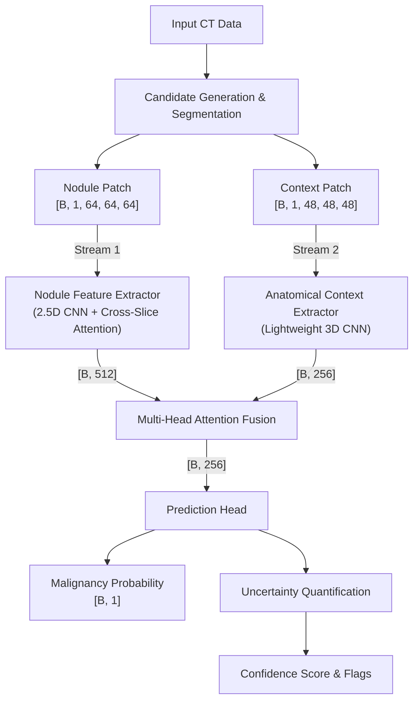
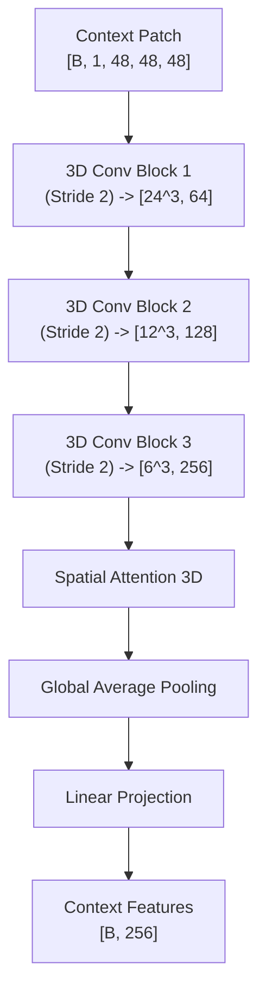
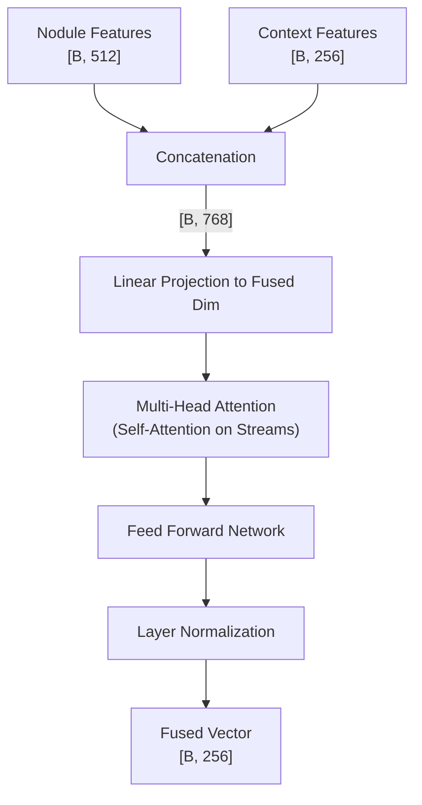
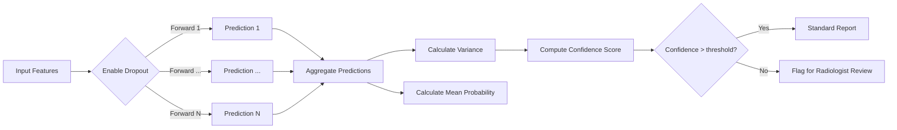

# Architecture: OncoVision-X (DCA-Net)

OncoVision-X utilizes the Dual-Context Attention Network (DCA-Net) to classify lung nodules with high precision and clinical uncertainty quantification. This memory-efficient architecture mimics the workflow of a radiologist by examining both the isolated nodule and the surrounding anatomical structures.

Below are detailed architectural diagrams of the system.

## 1. Overall System Architecture

The core architecture operates via a dual-stream process. Stream 1 extracts nodule-specific features using 2.5D slices, while Stream 2 extracts spatial and anatomical context using a lightweight 3D CNN.

## 2. Nodule Stream (2.5D Feature Extractor)

Stream 1 utilizes a 2.5D approach to process the 3D patch as a stack of 2D slices. This significantly reduces GPU memory footprints while capturing critical spatial relationships.

```mermaid
graph LR
    A["Nodule Patch<br/>[B, 1, 64, 64, 64]"] -->|Reshape| B["2D Slices<br/>[B*64, 1, 64, 64]"]
    B --> C[EfficientNet-B0 Backbone]
    C -->|"[B*64, 1280]"| D[Linear Projection]
    D -->|Reshape| E["Feature Volume<br/>[B, 64, 512]"]
    E --> F[Cross-Slice Attention]
    F --> G[1D Temporal Conv block]
    G --> H[Adaptive Avg Pool 1D]
    H --> I["Nodule Features<br/>[B, 512]"]
```

## 3. Anatomical Context Stream

Stream 2 captures lung vasculature, airways, and pleural boundaries using a highly efficient 3D Convolutional Neural Network.

## 4. Multi-Head Attention Fusion

The features from both streams are fused using a Multi-Head Attention mechanism to learn cross-feature dependencies effectively.

## 5. Uncertainty Quantification

For clinical trustworthiness, OncoVision-X predicts confidence estimates via Monte Carlo (MC) Dropout.

