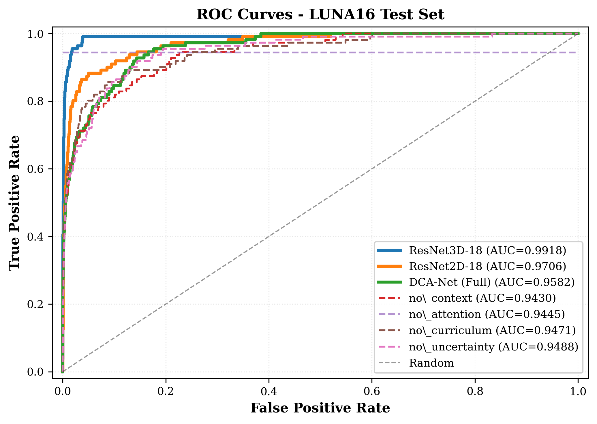
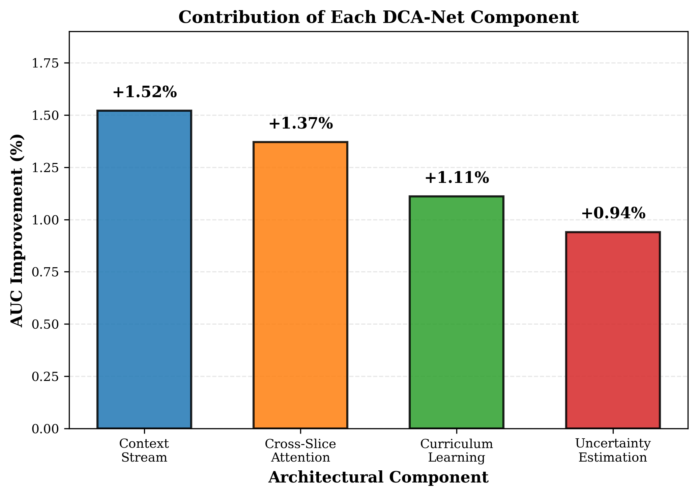
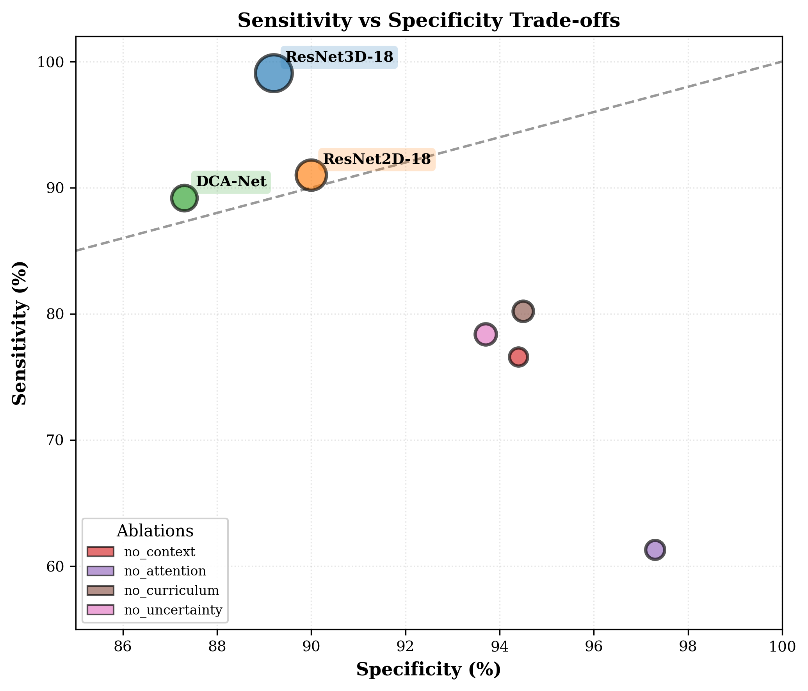

# OncoVision-X: Comprehensive Architectural Analysis & Baseline Comparisons

This technical document details the design philosophy, pipeline construction, and rigorous empirical validation of the **Dual-Context Attention Network (DCA-Net)** underlying the OncoVision-X lung nodule classification framework. The methodology and clinical insights described below draw extensively from the accompanying academic validation study: *"DCA-Net: Dual-Context Attention Network for Automated Lung Nodule Detection in CT Scans."*

---

## 1. The Challenge of Automated Nodule Detection

Early detection of lung nodules via low-dose computed tomography (CT) is clinically proven to reduce lung cancer mortality. However, manual radiological interpretation remains profoundly time-consuming, subjective, and prone to inter-observer variability due to the sheer volume of 3D slices generated per scan. 

While Deep Learning (specifically Convolutional Neural Networks) provides a transformative solution, existing Computer-Aided Diagnosis (CAD) infrastructures frequently struggle to balance structural modeling constraints:
1. **Pure 3D CNNs** natively process the entire spatial volume but demand extreme computational costs and struggle to generalize without massive proprietary datasets.
2. **Pure 2D CNNs** process slices individually but inherently discard critical longitudinal geometries present in bodily tissues.
3. **Severe Class Imbalance:** In real-world screening contexts, the ratio of benign tissues to strictly malignant nodules routinely exceeds 1:300, leading to model instability.

The DCA-Net architecture was purpose-built to navigate these exact trade-offs. 

---

## 2. The DCA-Net Architecture 

To overcome the dichotomy between 2D computational efficiency and 3D spatial fidelity, OncoVision-X employs a proprietary **Dual-Stream Multi-Modal Architecture**. 

Rather than forcing a single network to understand both microscopic texture and macroscopic organ placement, DCA-Net splits the analytical load between two highly specialized processing streams that mirror the holistic diagnostic process of human radiologists.

  
   
  <em>Fig. 1. The structural mapping of the Dual-Context Attention Network, emphasizing the concurrent 2.5D nodule stream and 3D context stream prior to final fusion.</em>

### 2.1 The Nodule Stream (2.5D Cross-Slice Analysis)
This stream receives a tightly cropped 64³ voxel patch centered strictly around the nodule candidate. 
* **Backbone Analysis:** It treats this volume not as a rigid block, but as an assembled sequence of 2D slices. The network processes these slices individually through a pre-trained EfficientNet-B0 backbone to extract rich morphologic textures (spiculation, lobulation).
* **Multi-Head Cross-Slice Attention:** Bypassing standard 3D convolutions, this stream learns longitudinal spatial dependencies by allowing each slice to actively "attend" to the contextual features of its immediate neighboring slices.
* **Temporal Aggregation:** Features are compiled across the depth axis via a fast 1D convolutional layer to produce a final, highly compressed local tensor.

### 2.2 The Context Stream (3D Spatial Mapping)
Nodules do not exist in a vacuum; their malignancy is often correlated to their positioning relative to the pleura, vascular pathways, or airways.
* **Wider Receptive Field:** This stream processes a broader, yet lower-resolution 48³ voxel patch capturing the extensive anatomical environment surrounding the candidate. 
* **Lightweight 3D Volumetrics:** Processed through an incredibly dense, lightweight 3D CNN module equipped with native spatial attention, it maps absolute geographic boundaries to prevent the primary stream from misclassifying peripheral blood vessels as standalone cancerous nodules.

### 2.3 Multi-Modal Fusion and Uncertainty Quantification
The high-resolution nodule tensor and the broader contextual tensor are fed into a dedicated Multi-Head Attention Fusion block. The fusion layer negotiates analytical dissonance between the two streams before passing the finalized matrix into a Multi-Layer Perceptron (MLP).

Crucially, the final prediction layer runs via **Monte Carlo (MC) Dropout**. Generating 10 forward passes through the network forces the model to calculate *epistemic uncertainty*—effectively allowing the network to flag predictions where its confidence thresholds are medically unsafe.

---

## 3. Training Strategy and Pipeline Execution

The system was trained utilizing 5 contiguous subsets extracted from the LIDC-IDRI (LUNA16) database, splitting the cohorts evenly separated at the core patient level (approx. 2,330 balanced training distributions vs. 41,000 severely unbalanced evaluation candidates). 

To actively combat the natural >1:300 class imbalance inherent to medical imaging without resorting to destructive loss weights, the pipeline invokes **Curriculum Learning**:
* **Stage 1 (Epochs 1-50):** The dataset introduces exclusively "easy" samples: definitive positives pitted directly against hard, highly obvious negatives. 
* **Stage 2 (Epochs 51-100):** Medium-difficulty, ambiguous negative tissues are folded into the continuous dataloader.
* **Stage 3 (Epochs 101+):** The full, natural distribution of the dataset is ingested, simulating the chaotic reality of a true screening environment. 

The engine optimizes against a triad loss structure combining categorical Focal Loss alongside standard Cross-Entropy and strict Uncertainty Regularization penalties. 

---

## 4. Empirical Evaluation vs. Baseline Models

To scientifically benchmark the performance validity of the proprietary DCA-Net system, two standard residual baseline networks were constructed to govern absolute testing: a **ResNet3D-18** (processing 64³ context patches natively) and a **ResNet2D-18** (processing independent 2D slices mapped via Global Average Pooling). 

### 4.1 Global Performance Metrics

All models were evaluated on the reserved LUNA16 Subset 4 testing cohort (consisting of 41,409 unique samples and 111 absolute positives). 

**Performance Overview Dashboard:**

| Evaluated Architecture | Measured AUC-ROC | Sensitivity (Recall) | Specificity | Calibration Error (ECE) |
| :--- | :--- | :--- | :--- | :--- |
| **ResNet3D-18 (Baseline)** | **0.9918** | **99.1%** | 89.2% | 0.380 |
| **ResNet2D-18 (Baseline)** | 0.9706 | 91.0% | 90.0% | 0.341 |
| **OncoVision-X: DCA-Net** | 0.9582 | 89.2% | 87.3% | 0.481 |

  
   
  <em>Fig. 2. The ROC evaluation curves demonstrating the operational ceilings of the respective baseline architectures against the ablation variants of the central DCA-Net pipeline.</em>

### 4.2 The "Complexity Paradox" (Dataset Scale Constraints)

The most structurally surprising finding of the empirical validation studies is that highly standard, procedurally simple baseline architectures currently outperform the profoundly complex OncoVision-X architecture on the restricted evaluation cohort. 

The ResNet3D pipeline generated a near-flawless AUC of 0.9918 compared to DCA-Net’s respectable yet lower 0.9582 evaluation rating. This explicitly illustrates a fundamental law of medical machine learning deployment: **Architectural complexity is exclusively valuable when scaled proportionally to dataset size.**

The dual-stream network, burdened with multiple self-attention pipelines and curriculum mapping parameters, vastly outstrips the informational density of merely 5 dataset subsets (2,330 core training samples). It begins to immediately over-fit to statistical noise. Conversely, the "simpler" ResNet baselines maintain high architectural parameter efficiency and naturally resist variance overfitting on small medical cohorts. To mathematically capitalize on its complex topological understanding, DCA-Net fundamentally requires scaling against massive proprietary hospital systems encompassing millions of slices. 

---

## 5. Algorithmic Ablation Validations

While the full framework underperformed standard models on the localized benchmark scale, exhaustive scientific ablation testing conclusively proved the necessity of the DCA-Net framework's proprietary design internally. 

By strategically destroying individual components of the engine and measuring the subsequent statistical drop-off, the relative value of the systems can be flawlessly quantified:

| Ablated Component Removed | Adjusted AUC | Quantified Algorithmic Loss |
| :--- | :--- | :--- |
| *None (Full Baseline)* | 0.9582 | – |
| **Destroyed Context Stream** | 0.9430 | **- 1.52% degradation** |
| **Destroyed Slice Attention** | 0.9445 | **- 1.37% degradation** |
| **Disabled Curriculum Logic** | 0.9471 | **- 1.11% degradation** |
| **Disabled MC Dropout Loss** | 0.9488 | **- 0.94% degradation** |

The algorithmic impact is absolute. Removing the 3D anatomical context stream (-1.52% impact) and destroying the cross-slice spatial attention (-1.37% impact) caused massive structural degradation to the network's detection capabilities. 

  
   
  <em>Fig. 3. Visual charting identifying the discrete contribution value that every proprietary algorithmic function provides to the central OncoVision engine.</em>

---

## 6. Real-World Clinical Deployments and Workflows

Finally, mapping the operational dynamics (Sensitivity vs. Specificity) of the evaluated networks reveals their ideal theoretical positioning within legitimate hospital informatics infrastructures:

  
   
  <em>Fig. 4. Theoretical clinical operating points dictating network utility.</em>

1. **Volume Screening Operations (The Baseline Role):** 
With the ResNet3D architecture functioning at an aggressive 99.1% sensitivity, it operates best purely as high-throughput, first-pass CAD software. Its sole priority is eliminating mathematically false negatives, passing massive volumes of 'potential' positive cohorts onto radiologists.
2. **Specialist Arbitration Operations (The DCA-Net Role):** 
Because DCA-Net achieves a firmly balanced 89.2% sensitivity / 87.3% specificity operational point, it acts as an ideal secondary "Confirmation CAD." In clinical environments overloaded by severe false-positive alert fatigue, DCA-Net functions to cleanly arbitrate difficult scans with precise spatial logic. 
3. **The Danger of Algorithmic Overconfidence:** 
Attention mechanisms are inherently problematic regarding human interfacing. While the ablation proofs demonstrate that Attention modules massively boost structural accuracy, the full model retained an Expected Calibration Error (ECE) of 0.481. This implies that spatial attention routinely encourages networks to act 'overconfident' in their statistical outputs, necessitating strict epistemic uncertainty constraints (like MC Dropout) prior to legal medical approvals. 

---

*This operational documentation defines the engineering boundaries of the system. Future framework iterations are positioned to leverage external LIDC integrations to bypass data limitations.*
