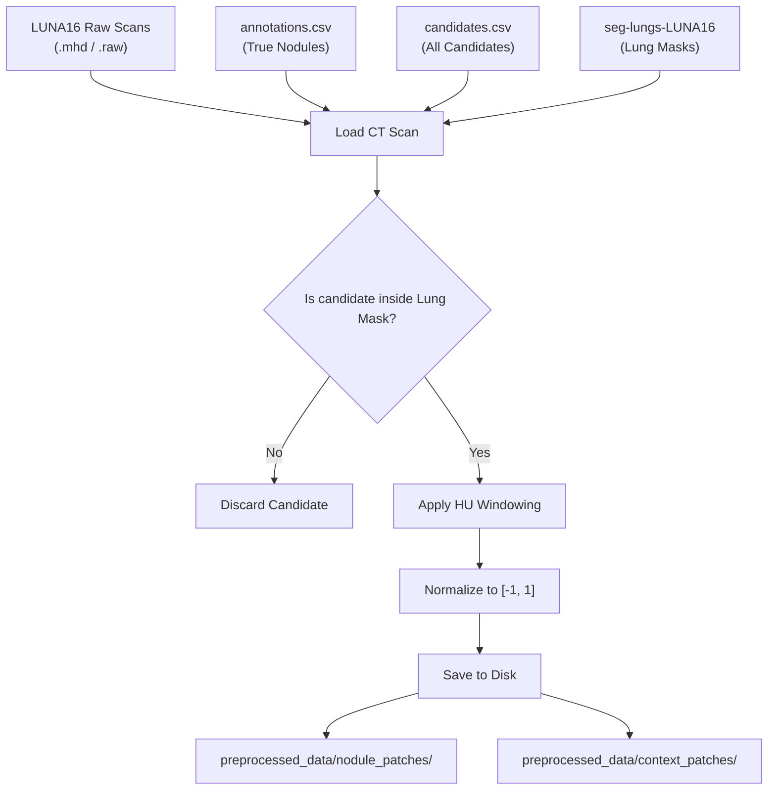
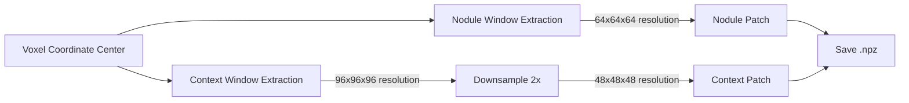
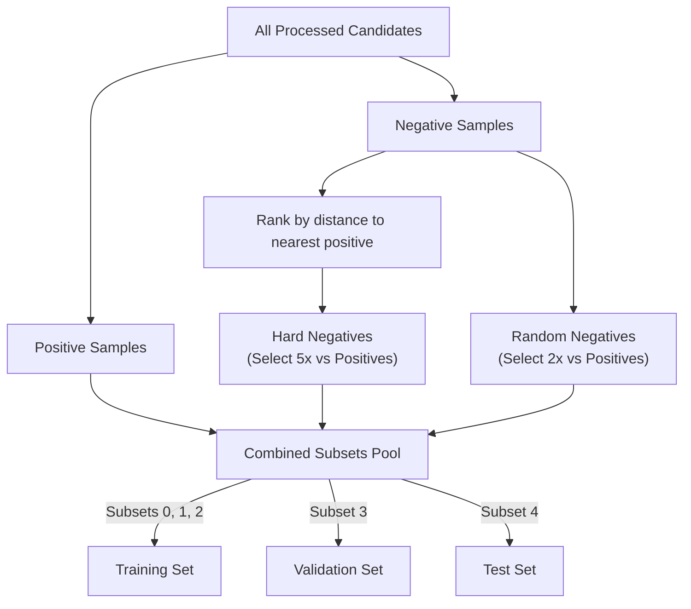

# Data Preprocessing Pipeline

Handling volumetric CT data efficiently is paramount. The OncoVision-X pipeline operates iteratively over the LUNA16 dataset, extracting regions of interest (ROI) and managing severe class imbalance.

## 6. LUNA16 Data Preprocessing Pipeline

The primary system converts massive `.mhd`/`.raw` files into bite-sized compressed `.npz` chunks readable by PyTorch dataloaders.

## 7. Patch Extraction Strategy

The dual extraction strategy simultaneously samples dense nodule volumes and wider contextual lung anatomy to serve our two distinct architecture streams.

## 8. Data Balancing & Split Logic

LUNA16 contains massive class imbalances (approximately 1:1350 positive to negative nodes). The preprocessing framework samples intelligently to achieve a reasonable 1:7 ratio in training.

