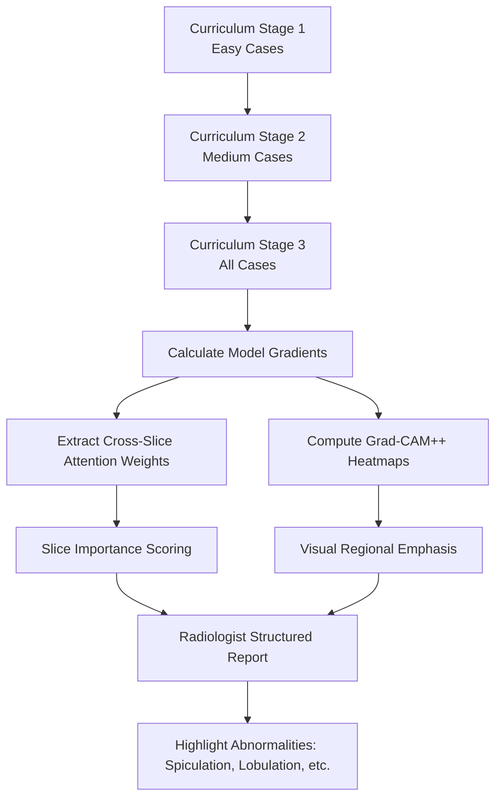
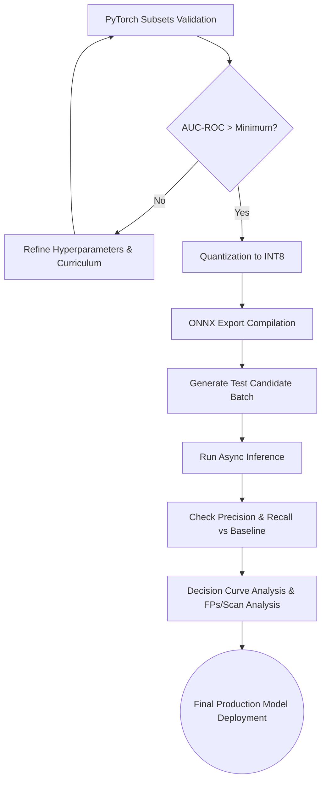

# Evaluation, Training, and Explainability

Model training for OncoVision-X utilizes a progressive curriculum learning strategy to systematically tackle difficult candidate nodule cases without overwhelming the optimizer or available VRAM resources.

## 9. Training Curriculum & Explainability (XAI) Architecture 

The architecture uniquely implements explainability into its training pipeline, relying on Grad-CAM++ algorithms and explicit Slice Importance derived from the internal attention mechanism.

## 10. System Evaluation & Deployment Integrations

The deployment pipeline relies on INT8 optimization to compress the model and accelerate processing. Validating clinical utility involves analyzing Expected Calibration Error (ECE) and True Positives versus False Positives (FPs).

