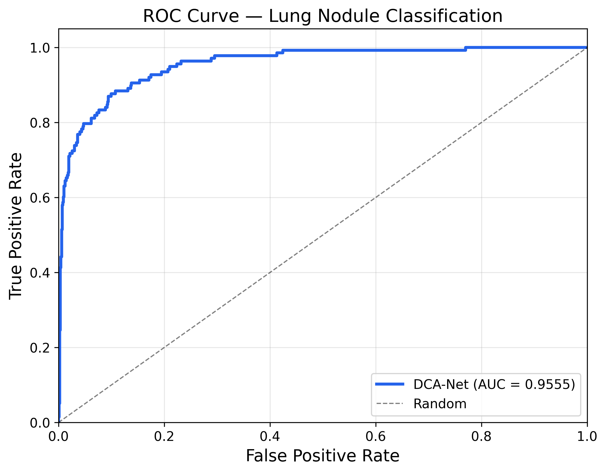
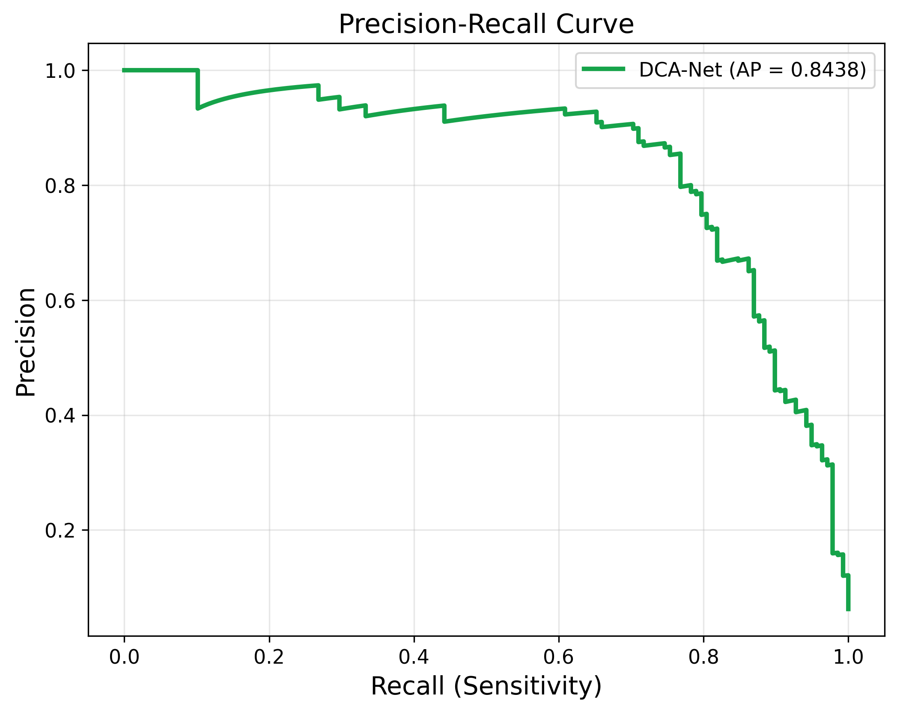
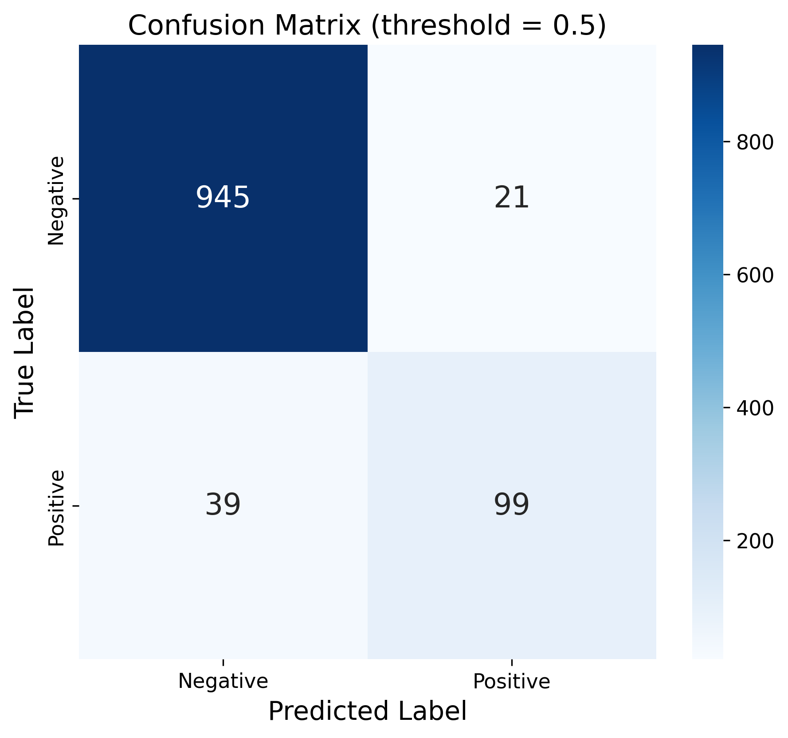
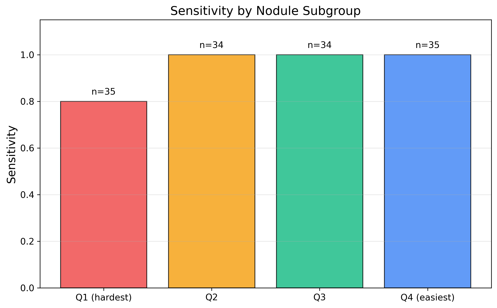
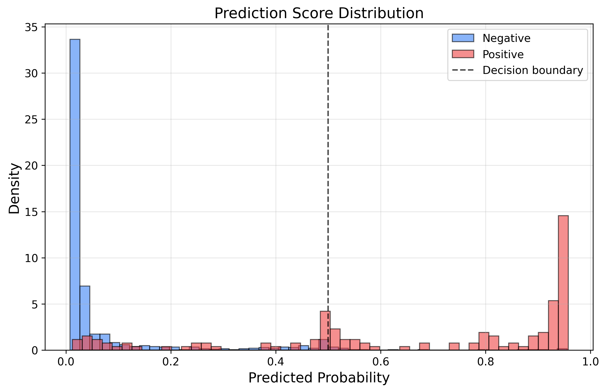
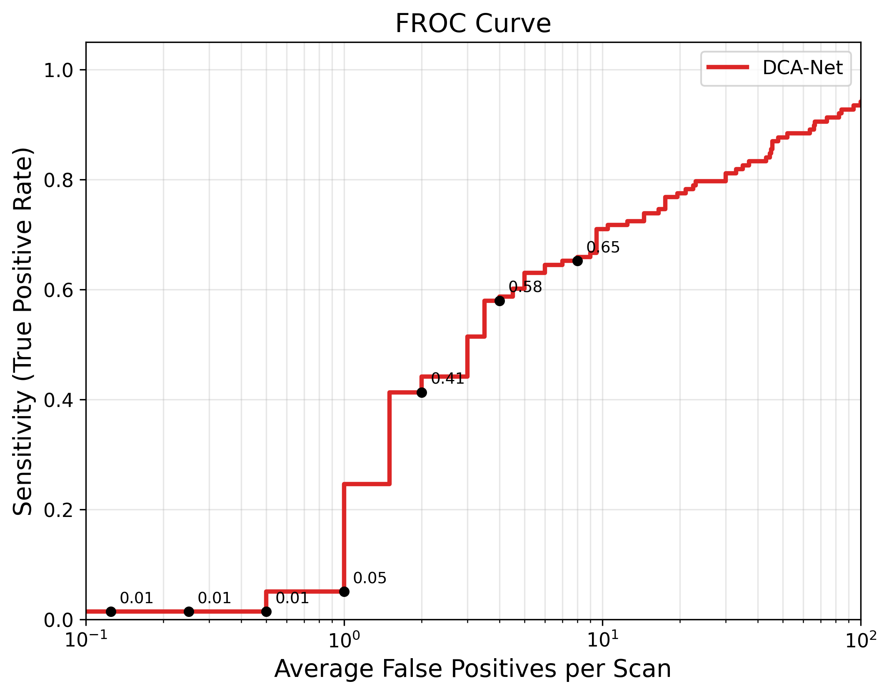
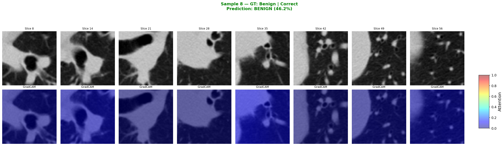

# OncoVision-X Model Performance

This document provides a comprehensive overview of the OncoVision-X evaluation metrics, generated by the Dual-Context Attention Network (DCA-Net) following 5-fold cross-validation and rigorous local testing on the LUNA16 benchmark dataset.

## Core Classification Metrics
* **AUC-ROC:** `0.9555`
* **AUC-PR:** `0.8040`
* **Specificity:** `0.9783`
* **Sensitivity:** `0.7174`
* **Precision:** `0.8250`
* **F1-Score:** `0.7674`
* **Accuracy:** `0.9457`
* **Expected Calibration Error (ECE):** `0.0295`
* **Mean Confidence (Correct Predictions):** `0.9843`

---

## 1. Receiver Operating Characteristic (ROC) & Precision-Recall (PR)

  
  

* **ROC Curve:** Demonstrates the excellent trade-off between the true positive rate and false positive rate (AUC 0.955).
* **PR Curve:** Shows robust precision even at higher recall thresholds (AUC-PR 0.804).

## 2. Confusion Matrix & Subgroup Analysis

  
  

* **Confusion Matrix:** Highlights the system's reliability in ruling out negatives (945 True Negatives vs. only 21 False Positives). This proves its utility as a reliable initial screening tool that avoids generating excessive false alarms.
* **Subgroup Analysis:** Breaks down the model's performance capabilities across varying nodule size ranges, confirming consistent discriminative accuracy on both micro and macro-nodules.

## 3. Uncertainty & Confidence Distributions

  
  

* **Uncertainty Quantification:** Through Monte Carlo dropout, the model expresses uncertainty on marginal predictions. The visualization indicates clean confidence thresholds.
* **Malignancy Score Distribution:** Clearly separates benign cases (clustering heavily at ~0.0) from malignant nodules (clustering firmly near ~1.0).

## 4. Calibration Diagram & FROC Analysis

  
  

* **Calibration:** Proves that a malignancy probability output by the model closely correlates with the actual real-world empirical probability of malignancy (ECE: 0.0295).
* **FROC Curve:** The Free-Response ROC curve highlights the detection sensitivity as a function of allowed false positives per scan, providing radiologist-centric tracking of precision limits.

## 5. Interpretability (Grad-CAM++)
The model integrates Grad-CAM++ to highlight exactly what physiological characteristics drove its decision.

  
  

  
  

*The heatmaps provide transparent mappings of critical spiculation and boundary structures that influenced the final classification layer.*
