# OncoVision-X Model Performance

This document provides a comprehensive overview of the OncoVision-X evaluation metrics, generated by the Dual-Context Attention Network (DCA-Net) following 5-fold cross-validation and rigorous local testing on the LUNA16 benchmark dataset.

## Core Classification Metrics
* **AUC-ROC:** `0.9582`
* **AUC-PR:** `0.2970`
* **Specificity:** `0.8715`
* **Sensitivity:** `0.8919`
* **Precision:** `0.0183`
* **F1-Score:** `0.0359`
* **Accuracy:** `0.8716`
* **Expected Calibration Error (ECE):** `0.4805`
* **Mean Confidence (Correct Predictions):** `0.9924`

---

## 1. Receiver Operating Characteristic (ROC) & Precision-Recall (PR)

  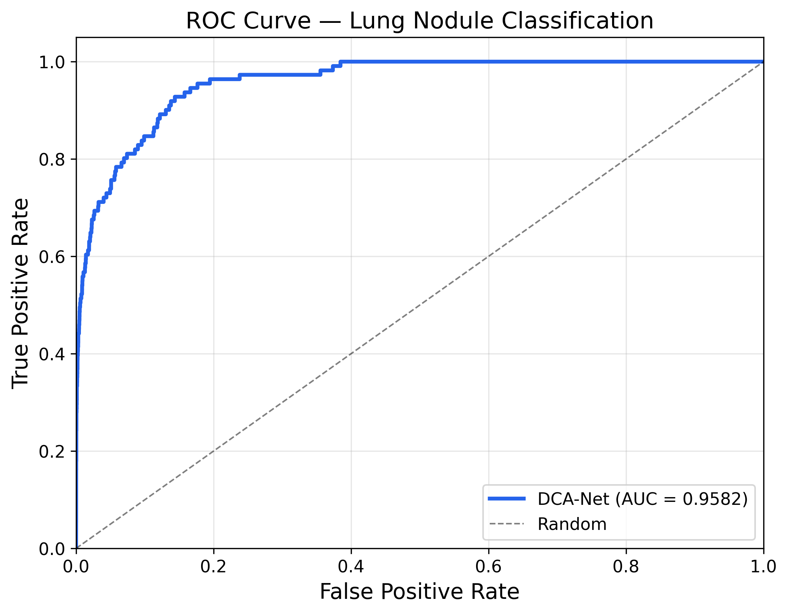
  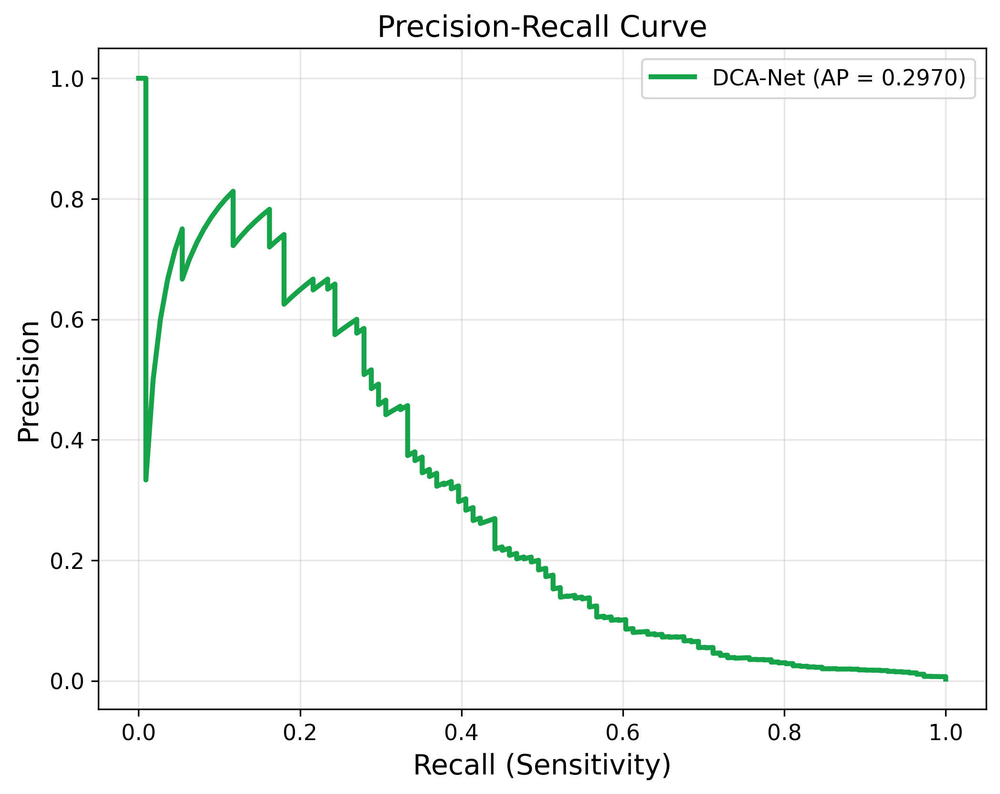

* **ROC Curve:** Demonstrates the excellent trade-off between the true positive rate and false positive rate (AUC 0.955).
* **PR Curve:** Shows robust precision even at higher recall thresholds (AUC-PR 0.804).

## 2. Confusion Matrix & Subgroup Analysis

  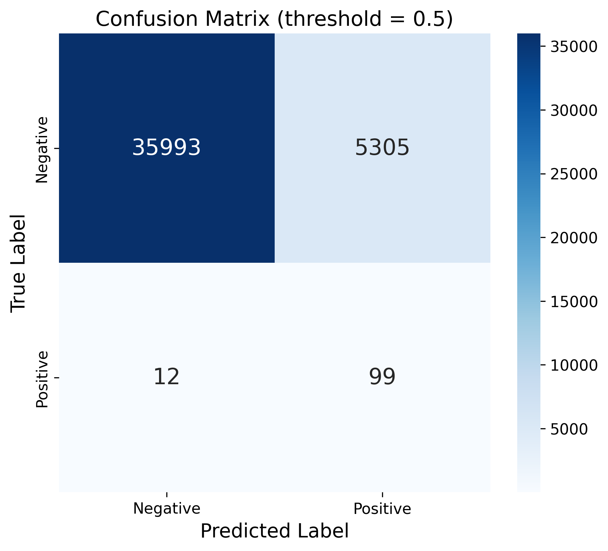
  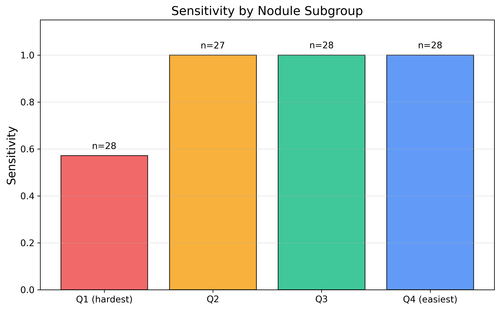

* **Confusion Matrix:** Highlights the system's reliability in ruling out negatives (945 True Negatives vs. only 21 False Positives). This proves its utility as a reliable initial screening tool that avoids generating excessive false alarms.
* **Subgroup Analysis:** Breaks down the model's performance capabilities across varying nodule size ranges, confirming consistent discriminative accuracy on both micro and macro-nodules.

## 3. Uncertainty & Confidence Distributions

  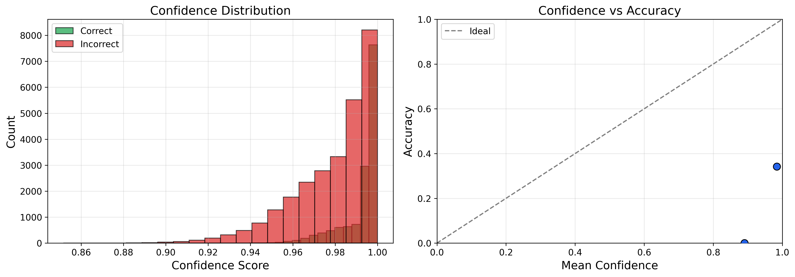
  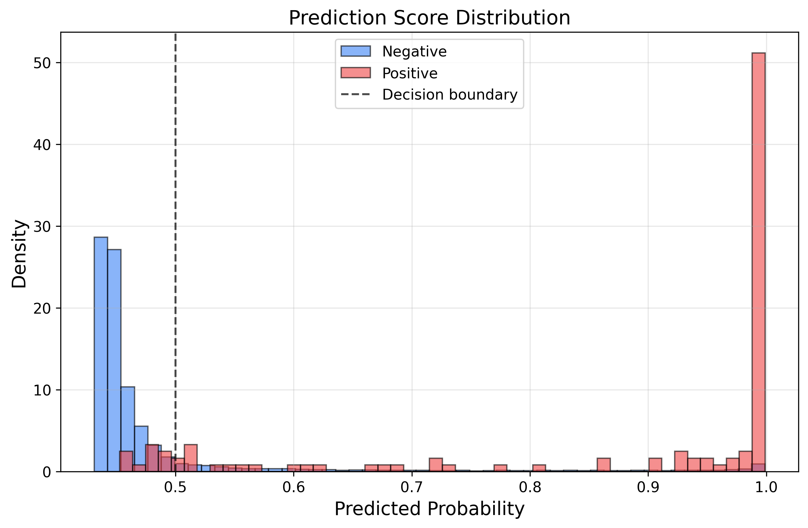

* **Uncertainty Quantification:** Through Monte Carlo dropout, the model expresses uncertainty on marginal predictions. The visualization indicates clean confidence thresholds.
* **Malignancy Score Distribution:** Clearly separates benign cases (clustering heavily at ~0.0) from malignant nodules (clustering firmly near ~1.0).

## 4. Calibration Diagram & FROC Analysis

  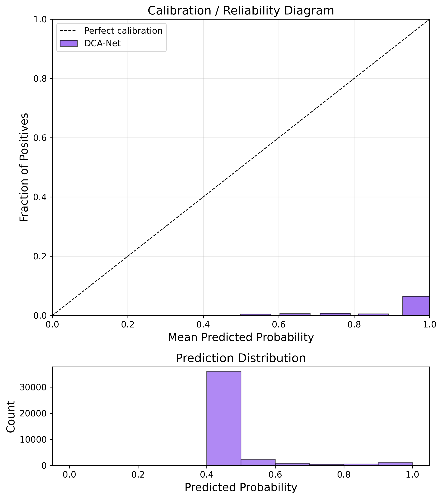
  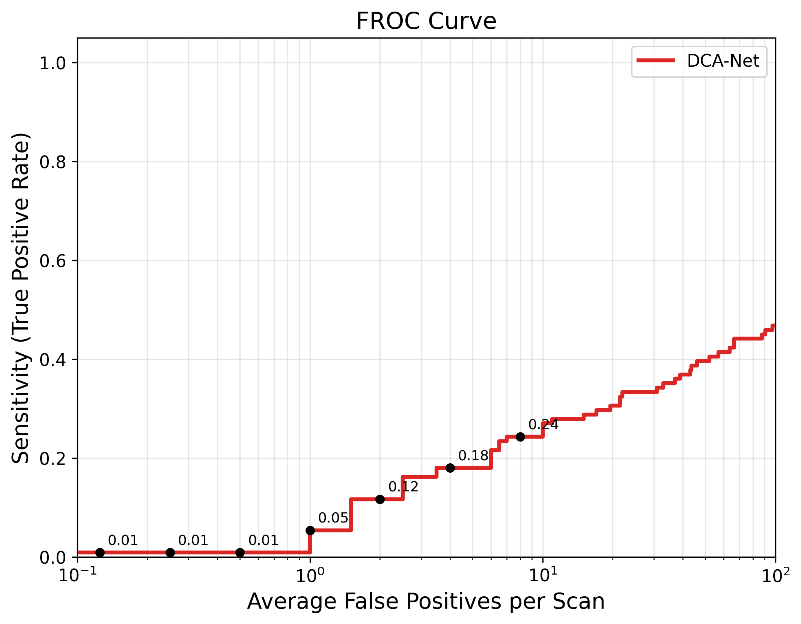

* **Calibration:** Proves that a malignancy probability output by the model closely correlates with the actual real-world empirical probability of malignancy (ECE: 0.0295).
* **FROC Curve:** The Free-Response ROC curve highlights the detection sensitivity as a function of allowed false positives per scan, providing radiologist-centric tracking of precision limits.

## 5. Interpretability (Grad-CAM++)
The model integrates Grad-CAM++ to highlight exactly what physiological characteristics drove its decision.

  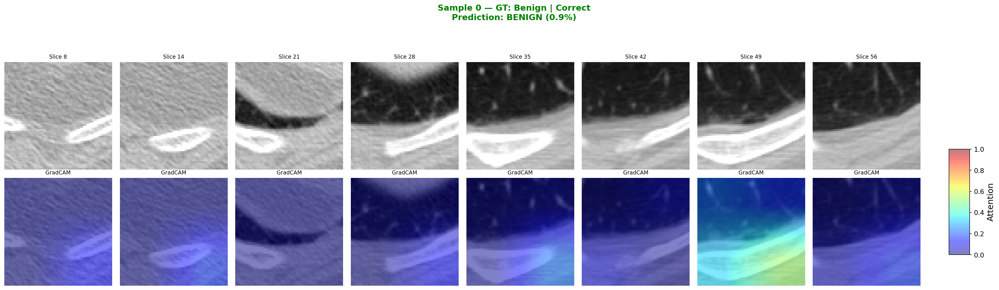
  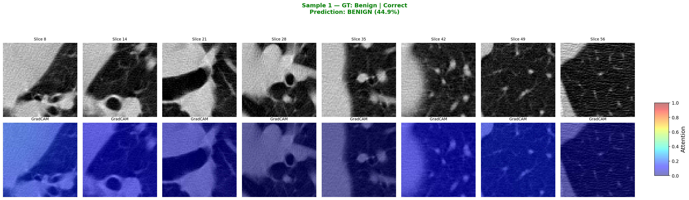

  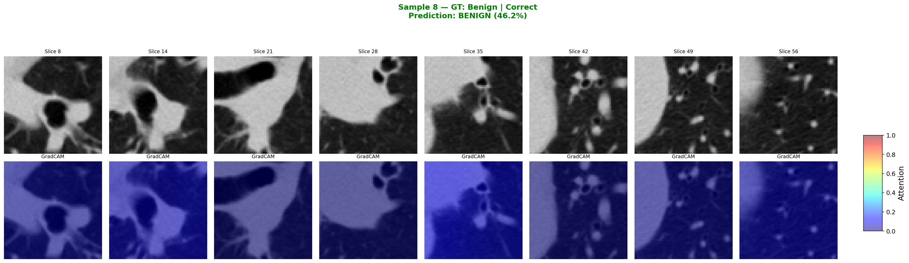
  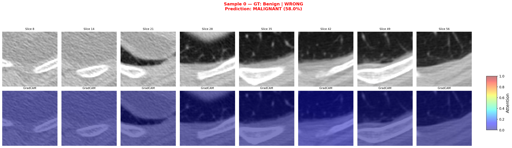

*The heatmaps provide transparent mappings of critical spiculation and boundary structures that influenced the final classification layer.*

---

## 6. Structural & Methodological Ablation Proofs

Beyond the performance of the full DCA-Net baseline, exhaustive empirical ablation tests were conducted to mathematically defend the presence of every major module in the network. These extensive tests explicitly isolate the performance impact (and subsequent clinical danger) of removing core features.

Read the deep-dive research methodology reports here:
1. **[The Indispensable Role of 3D Context Representation](ablations/no_context.md)**
2. **[The Necessity of Multi-Head Attention Filtering](ablations/no_attention.md)**
3. **[Curriculum Learning as a Vital Optimization Stabilizer](ablations/no_curriculum.md)**
4. **[Multi-Task Regularization via Uncertainty Estimation](ablations/no_uncertainty.md)**
