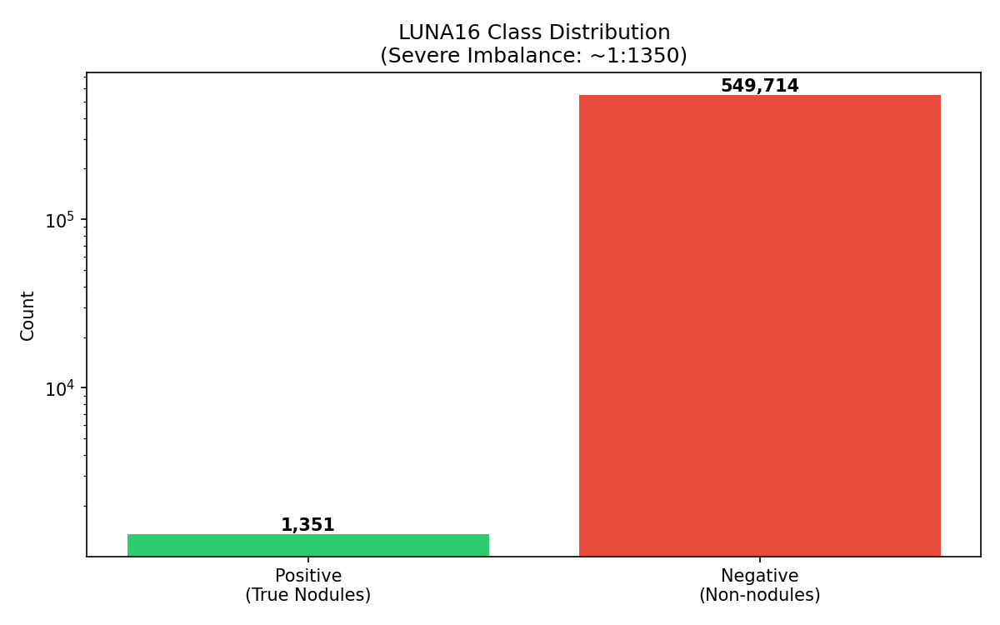
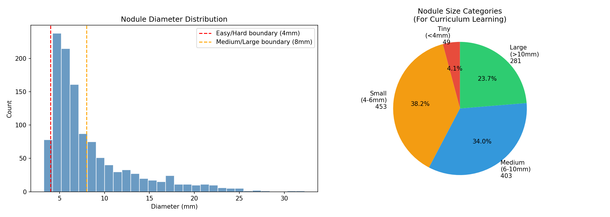
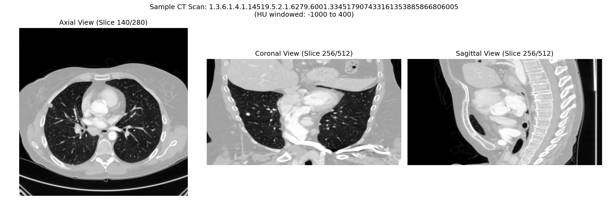

# LUNA16 Data Exploration Report

## Dataset Overview

- **Total CT Scans**: 445
- **Total True Nodules**: 1351
- **Total Candidates**: 551065
- **Class Imbalance**: 1:407

## Subset Distribution

| Subset | Scans | Purpose |
|--------|-------|--------|
| subset0 | 89 | Train |
| subset1 | 89 | Train |
| subset2 | 89 | Train |
| subset3 | 89 | Validation |
| subset4 | 89 | Test |

## Nodule Size Distribution

- **Tiny (<4mm)**: 49
- **Small (4-6mm)**: 453
- **Medium (6-10mm)**: 403
- **Large (>10mm)**: 281

## Key Figures

## Hardware Considerations

- **Single scan size**: ~140 MB
- **Scan shape**: [280, 512, 512]
- **GPU VRAM**: 3.5GB (RTX 3050)
- **Strategy**: Extract patches, don't load full scans
